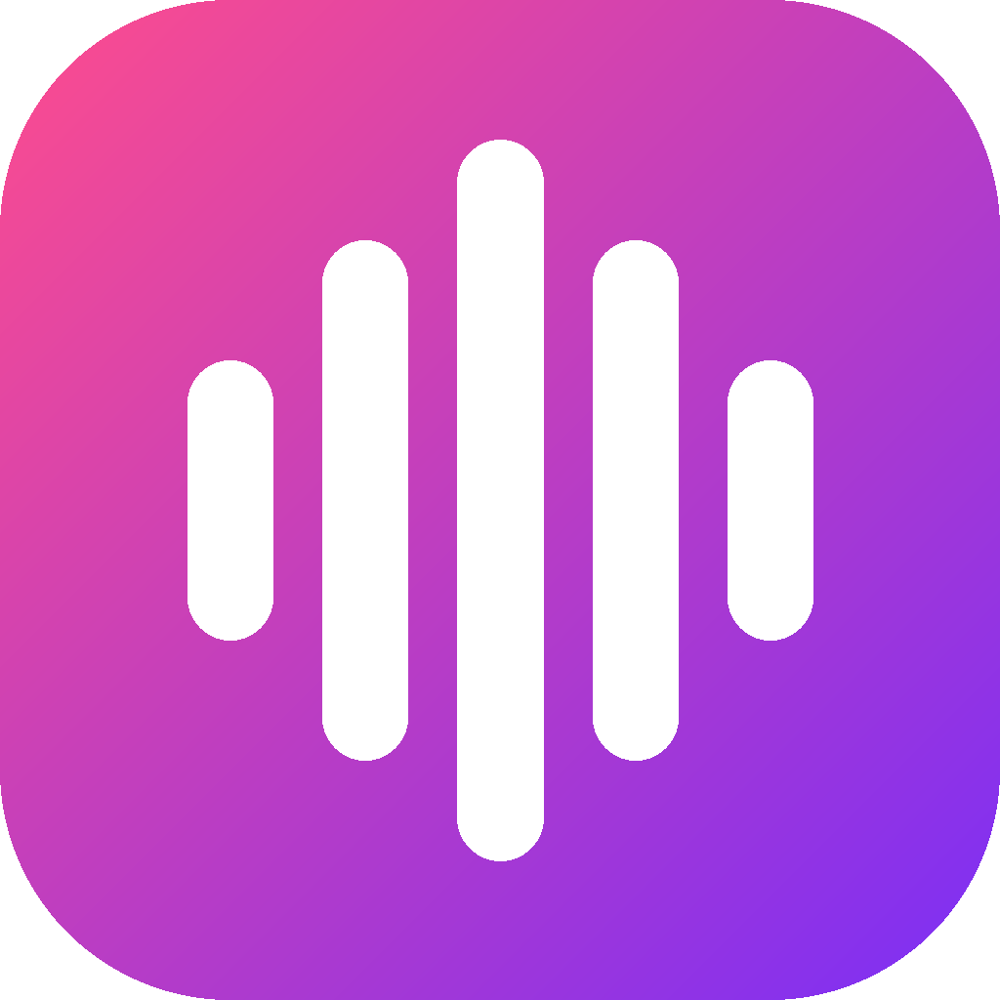

<p align="center">
  
</p>

<h1 align="center">Boobies Soundpad</h1>

<p align="center">
  Free soundboard for your virtual mic, plus a <b>YouTube Live</b> tab:<br>
  search any sound or song and it plays straight into Discord or your game.
</p>

---

## What it does

- **YouTube Live:** search any sound or song (or paste a link), hit ▶ and friends hear it instantly. Drag the bar to jump around.
- **Cut a clip:** mark start and end while it plays, preview it, then **Pin** it (streams, takes no space) or **Save MP3** (offline file, auto-added to your board).
- **Text to Speech:** natural Microsoft voices in Hindi, English (India/US/UK) and 100+ languages. Pick speed and pitch, Ctrl+Enter to speak, save lines to your board.
- **Hotkeys per sound:** right-click a sound → Set hotkey. Press once to play, again to stop.
- **Drag & drop:** drop MP3/WAV/M4A/FLAC files (or a whole folder) onto the board.
- **Mixer:** separate volume for what friends hear and what you hear, mic volume, mute, and a noise gate with a live meter so games don't pick up hiss.


## Setup (one time)

1. Run `BoobiesSoundpad.exe`. If VB-Cable isn't installed, the app offers to install it. **Restart your PC** after that.
2. In the app go to **Settings**:
   - **Playback device:** `CABLE Input`
   - **Microphone input:** your real mic
3. In Discord or your game, set the input device to **`CABLE Output`**.
4. Open **YouTube Live**, search something and hit ▶.

Default hotkeys: **F9** play/pause, **F10** stop, **F11** pause. You can change them in Settings.

### Game can't hear you, or the mic is noisy?

1. Settings → **Open Windows sound settings**.
2. Playback tab → CABLE Input → Properties → Advanced: **2 channel, 16 bit, 48000 Hz**, untick both *Exclusive mode* boxes. Do the same for **CABLE Output** on the Recording tab.
3. Recording tab → right-click CABLE Output → **Set as Default Communication Device**. Restart the game.
4. In the app (Settings → Your mic) raise the **noise gate** until the meter says *gated* when you're quiet.

## Build it yourself

**Easy way:** double-click `build.bat`. It installs the .NET 8 SDK if needed and puts the app in `publish\BoobiesSoundpad.exe`.

**Manual:**
```
dotnet publish BoomBx.csproj -c Release -o publish
```

**On GitHub:** push this folder to a repo. The included workflow builds the exe on every push (Actions tab → latest run → Artifacts). Push a tag like `v0.2.0` and it also makes a Release with the exe attached, so you can share that link with friends.

## If YouTube stops working

YouTube changes its system every now and then.

- First, rebuild: the YouTube library updates itself on every build.
- The app also has a backup player (yt-dlp) that it downloads once, on its own, if the main method fails. It's stored in `%AppData%\BoobiesSoundpad\tools`.
- You can also put a newer `yt-dlp.exe` next to `BoobiesSoundpad.exe` and the app will use that one first.

## Notes

- Windows 10/11 only, because playback uses Windows Media Foundation and VB-Cable.
- This is a personal tool for having fun with friends. Streaming from YouTube outside its official player goes against YouTube's Terms of Service, so don't sell it or run it as a service.
- App data (soundboards, icons, settings, log): `%AppData%\BoobiesSoundpad`

## Credits and license

Built on **[BoomBx](https://github.com/sardeq/BoomBx)** by sardeq, licensed under Apache 2.0. See `LICENSE` and `NOTICE` for the full license and the list of changes.
YouTube search and streaming use [YoutubeExplode](https://github.com/Tyrrrz/YoutubeExplode), with [yt-dlp](https://github.com/yt-dlp/yt-dlp) as a backup. Audio runs on [NAudio](https://github.com/naudio/NAudio).
